<div align="center">
  

  <h1>Apricity</h1>

  <p>
    <strong>A local, zero-dependency front-end for
    <a href="https://github.com/MemPalace/mempalace">MemPalace</a> — browse, search, write,
    edit, and curate your personal-memory store and knowledge graph from your browser.</strong>
  </p>

  <p>
    <a href="LICENSE"></a>
    <a href="https://pypi.org/project/apricity/"></a>
    
    
    
    <a href="https://github.com/epinethrone/apricity/releases"></a>
  </p>
</div>


## What is Apricity?

[MemPalace](https://github.com/MemPalace/mempalace) gives your AI assistant a structured, durable memory — wings, rooms, drawers, and a knowledge graph, all stored locally. **Apricity is the front-end for it.** Once you have hundreds of memories, you need a way to **see, search, and curate** them without dropping to SQL or living inside an MCP shell. That's what Apricity is for.

It is *not* a memory system of its own — it reads and writes an existing MemPalace install on the same machine, through the official `mempalace` package. Think of it as the window onto your palace.

- 🏠 **Local-first.** Binds to `127.0.0.1`. Nothing leaves your machine. No telemetry. No accounts. No cloud.
- 🪶 **Zero runtime dependencies.** Pure-Python standard-library server + plain HTML / CSS / vanilla JS front-end. No `pip install`, no `npm`, no Docker, no build step.
- 🛡️ **Safe by construction.** Every write goes through the official `mempalace` Python package. Every destructive action is snapshotted and recoverable. ETag concurrency control prevents lost edits.
- ⚡ **Fast.** Reads the SQLite/Chroma backends directly; a localStorage cache, gzip, and serve-time minification make reloads feel instant.
- ⌨️ **Keyboard-driven.** `⌘K` to search, `E` to edit, `F` to browse, `R` to reload — and every shortcut is remappable.

> ⚠️ Apricity expects an installed and initialised MemPalace instance on the same machine. It does **not** ship MemPalace itself — install it first from [MemPalace/mempalace](https://github.com/MemPalace/mempalace).

## Contents

- [Features](#features)
- [Quickstart](#quickstart)
- [Configuration](#configuration)
- [Securing Apricity](#securing-apricity)
- [Keyboard shortcuts](#keyboard-shortcuts)
- [API reference](#api-reference)
- [Safety model](#safety-model)
- [Architecture](#architecture)
- [Troubleshooting](#troubleshooting)
- [FAQ](#faq)
- [Contributing](#contributing)
- [Security](#security)
- [License](#license)

## Features
### Browse & navigate

<div align="center">
  <picture>
    <source media="(prefers-color-scheme: dark)" srcset="assets/apricity-search-dark.svg" />
    <source media="(prefers-color-scheme: light)" srcset="assets/apricity-search-light.svg" />
    
  </picture>
  <br />
  <sub>The search bar's always-on rotating ring — Apricity's “alive and listening” affordance. <code>⌘K</code> from anywhere.</sub>
</div>

- **Search** across content and metadata, **filter** by author, and **sort** by date or title (with a configurable default). `⌘K` focuses it from anywhere; `Enter` jumps to the first match.
- **Three panes** — a Rooms sidebar (wings → rooms, iOS-style drill-down), a Memories list, and a Detail view.
- **Browse mode** — maximize the Memories panel into an adaptive multi-column grid; toggle with `F`.
- **Wiki-style links** — `[[drawer_id|Display Title]]` references in memory content become clickable jumps to the linked memory, with one-click back-navigation.
- **URL state** — the current wing / room / memory / query / sort survive reloads and are linkable.

### Write & edit

<div align="center">
  <picture>
    <source media="(prefers-color-scheme: dark)" srcset="assets/apricity-editor-dark.svg" />
    <source media="(prefers-color-scheme: light)" srcset="assets/apricity-editor-light.svg" />
    
  </picture>
  <br />
  <sub>The inline WYSIWYG editor — circular toolbar, live bold/italic, <code>## </code> → heading autoformat, and callouts. No modal, no raw-Markdown round-trip.</sub>
</div>

- **Inline visual editor** — a WYSIWYG editor for bold/italic, headings, lists, links, and callouts, with Markdown autoformatting and HTML→Markdown conversion on save. No modal, no raw-Markdown round-trip.
- **Edit metadata** — change content, title, wing, and room, or move a memory between rooms, with content-hash ETag protection against concurrent edits.
- **Optimistic saves** — edits apply instantly and revert automatically (with a notification and a retry affordance) if the server rejects them.
- **Drafts inbox** — stage partial memories, edit them in place, and file them into the palace when ready.

### Curate & recover

<div align="center">
  <picture>
    <source media="(prefers-color-scheme: dark)" srcset="assets/apricity-recover-dark.svg" />
    <source media="(prefers-color-scheme: light)" srcset="assets/apricity-recover-light.svg" />
    
  </picture>
  <br />
  <sub>Nothing is ever lost — every delete is snapshotted into <strong>Recently deleted</strong>, one click from restore.</sub>
</div>

- **Delete** a single memory, a whole room, or a whole wing — every delete is snapshotted to a recoverable log.
- **Recently deleted** — restore a deleted memory with one click (optimistically), or purge the log.
- **Knowledge graph** — view triples, add new facts, invalidate stale ones, and explore a force-directed graph visualisation.
- **Tunnels** — cross-room / cross-wing links surfaced inline as room chips; create and delete them, bind them to specific memories, and inspect them on a dedicated tunnel page.

### Stay in the loop

<div align="center">
  <picture>
    <source media="(prefers-color-scheme: dark)" srcset="assets/apricity-notify-dark.svg" />
    <source media="(prefers-color-scheme: light)" srcset="assets/apricity-notify-light.svg" />
    
  </picture>
  <br />
  <sub>The bell rings as each model files or revises a memory — per-model avatars, <strong>created</strong> vs <strong>updated</strong> at a glance.</sub>
</div>

- **Notifications** — a bell that surfaces newly created and updated memories with the originating model's avatar (Claude, Codex, …), distinguishing *created* from *updated*.
- **Recently-updated markers** — memories touched recently get a relative-time marker that clears once you've viewed them.
- **Live polling** — optional background refresh (15 / 30 / 60 s) that pauses when the tab is hidden, with an optional sound and LAN-wide "seen" sync so dismissing on one device clears it everywhere.

### Make it yours
- **Tools panel** — a power-user sheet that surfaces MemPalace's MCP tools: knowledge-graph query + timeline, tunnels (list, create, delete, find, follow, traverse), diary (read / write), stats, and maintenance (taxonomy, duplicate check, hook settings, sync, reconnect, AAAK spec). Hidden by default; enable it in Settings. See the [API reference](#api-reference) for the underlying endpoints.
- **Settings** — a redesigned sheet with sidebar navigation covering Display (theme, reduce-motion, relative time, title/name polishing, panel-control reveal), Account, Notifications, remappable keyboard Shortcuts, and an About pane with an update-available check.
- **Theme** — Auto / Light / Dark, overriding or following the system preference, with your choice persisted.
- **Auth** — optional username + password lock with PBKDF2-SHA256 hashing and HTTP-only session cookies (12-hour default, 30-day "Remember me").

## Quickstart

### Prerequisites

- Python **3.11 or newer** (Apricity itself uses only the standard library — no `pip install` required).
- A working **MemPalace** install with its own venv. Apricity shells out to it for writes, so it must be importable from `$MEMPALACE_PYTHON_BIN`.

### Run from a clone (no install step)

The whole server is one file of standard-library Python, so the simplest way to run Apricity is straight from a checkout:

```bash
git clone https://github.com/epinethrone/apricity
cd apricity
python3 server.py            # equivalent to `python -m mempalace_dashboard`
```

Then open <http://127.0.0.1:8765>.

### Install as a command

Prefer an isolated, on-`PATH` install? Use pipx (or `uv tool install`):

```bash
pipx install apricity
apricity
```

> [!NOTE]
> The PyPI package is named `apricity`. If it isn't published yet, install from a clone (above) or from a [GitHub Release](https://github.com/epinethrone/apricity/releases) in the meantime.

There's no build step and no third-party runtime dependencies — the package is published purely so installing it is one command. If your MemPalace install lives somewhere non-standard, copy [`.env.example`](.env.example) to `.env` (or export the variables in your shell) and adjust the paths before launching.

### First-run checklist

1. ✅ MemPalace itself is installed and you've successfully filed at least one memory through it.
2. ✅ `~/.mempalace/palace/chroma.sqlite3` and `~/.mempalace/knowledge_graph.sqlite3` exist (or you've pointed `MEMPALACE_PALACE_DB` / `MEMPALACE_KG_DB` at where they actually live).
3. ✅ `MEMPALACE_PYTHON_BIN` points at a Python that can `import mempalace`.
4. ✅ You opened Apricity, clicked **Settings**, and set a username + password.

## Configuration

All filesystem locations default to the standard MemPalace home (`~/.mempalace`). Override with environment variables if your installation differs (see [`.env.example`](.env.example) for a starter file):

| Variable | Default | Purpose |
|---|---|---|
| `PORT` | `8765` | Port Apricity listens on. |
| `MEMPALACE_HOME` | `~/.mempalace` | Root for all of Apricity's data. |
| `MEMPALACE_PALACE_DB` | `<HOME>/palace/chroma.sqlite3` | The Chroma SQLite backend. |
| `MEMPALACE_KG_DB` | `<HOME>/knowledge_graph.sqlite3` | The knowledge-graph SQLite database. |
| `MEMPALACE_INBOX` | `<HOME>/dashboard-inbox` | Where drafts are staged before filing. |
| `MEMPALACE_VERSIONS` | `<HOME>/dashboard-versions.jsonl` | Append-only log of deletes and edits (powers Recently deleted). |
| `MEMPALACE_CREDENTIALS` | `<HOME>/dashboard-credentials.json` | Username + PBKDF2 hash. Mode `0600`. |
| `MEMPALACE_SESSIONS` | `<HOME>/dashboard-sessions.json` | Active session tokens. Mode `0600`. |
| `MEMPALACE_PREFERENCES` | `<HOME>/dashboard-preferences.json` | Server-side UI preferences (sort, theme, notification settings). |
| `MEMPALACE_PYTHON_BIN` | `~/.local/share/mempalace-venv/bin/python` | Python that can import `mempalace`. |
| `MEMPALACE_TOKEN` | _(unset)_ | Optional shared-secret used by scripts via the `X-Auth-Token` header. Coexists with the cookie flow. |

## Securing Apricity

1. Start the server, open the UI, click **Settings**.
2. Choose a username and password (≥ 8 characters).
3. Save — you're logged in immediately and Apricity refuses every other client until they sign in.

Credentials are stored as `pbkdf2_sha256$200000$<salt>$<hash>` and never leave the host.

If you forget the password, delete `~/.mempalace/dashboard-credentials.json` and `~/.mempalace/dashboard-sessions.json` and restart the server — Apricity reverts to open setup mode so you can re-enroll.

For scripted access, set `MEMPALACE_TOKEN=<some-secret>` in the environment and send it as the `X-Auth-Token` header. This coexists with the cookie flow; it does not replace it.

## Keyboard shortcuts

Every shortcut is remappable under **Settings → Shortcuts**. The defaults:

| Shortcut | Action |
|---|---|
| `⌘K` / `Ctrl+K` | Focus the search box |
| `Enter` (in search) | Jump to the first matching memory |
| `E` | Edit the open memory (or maximize the detail panel) |
| `F` | Toggle Browse mode (when no memory is selected) |
| `R` | Reload palace data |
| `Esc` | Close any open sheet (write, drafts, settings, login) |

## API reference

All endpoints are JSON over HTTP. Auth is by session cookie (`mempalace_session`) or `X-Auth-Token` header when `MEMPALACE_TOKEN` is set.

| Method | Path | Auth | Purpose |
|---|---|---|---|
| `GET`  | `/health` | open | Liveness + whether auth is active. |
| `GET`  | `/api/session` | open | Current auth state. |
| `POST` | `/api/login` | open | `{username, password, remember}` — issues a session cookie. |
| `POST` | `/api/logout` | open | Clears the session. |
| `GET`  | `/api/palace` | auth | Full palace snapshot (wings, drawers, triples, stats). |
| `GET`  | `/api/search?q=…` | auth | Filtered subset of drawers + triples. |
| `GET`  | `/api/versions` | auth | Recently deleted/edited snapshots. |
| `POST` | `/api/memories` | auth | File a new memory. |
| `POST` | `/api/memories/update` | auth | Patch content / wing / room of an existing drawer; supports ETag. |
| `POST` | `/api/delete` | auth | Delete a drawer, room, or wing (`{scope, …, confirm: "DELETE"}`). |
| `GET`  | `/api/drafts` | auth | List drafts; `?id=<draft-id>` returns one with body. |
| `POST` | `/api/drafts` | auth | Save a new draft. |
| `POST` | `/api/drafts/update` | auth | Replace a draft in place. |
| `POST` | `/api/drafts/delete` | auth | Remove a draft. |
| `POST` | `/api/drafts/commit` | auth | File a draft into the palace. |
| `POST` | `/api/versions/restore` | auth | Recreate a deleted memory from a snapshot. |
| `POST` | `/api/versions/delete` | auth | Remove one snapshot from the log. |
| `POST` | `/api/versions/clear` | auth | Wipe the snapshot log (`{confirm: "CLEAR"}`). |
| `POST` | `/api/facts` | auth | Add a knowledge-graph triple. |
| `POST` | `/api/facts/invalidate` | auth | Mark a triple as ended. |
| `GET`  | `/api/settings` | auth | Whether credentials are configured + username. |
| `POST` | `/api/settings/credentials` | auth | Set or rotate the username + password. |
| `GET`  | `/api/kg/query?entity=…&direction=…&as_of=…` | auth | Query KG facts about an entity. |
| `GET`  | `/api/kg/timeline?entity=…` | auth | Chronological view of an entity's facts. |
| `GET`  | `/api/kg/stats` | auth | Knowledge-graph aggregate stats. |
| `GET`  | `/api/graph/stats` | auth | Palace graph stats. |
| `GET`  | `/api/taxonomy` | auth | Current wing/room taxonomy tree. |
| `GET`  | `/api/checkpoint` | auth | Memories-filed-away state (recent checkpoint). |
| `GET`  | `/api/aaak-spec` | auth | AAAK spec reference. |
| `GET`  | `/api/diary?agent_name=…&last_n=…&wing=…` | auth | Read agent diary entries (latest `last_n`, capped at 200). |
| `POST` | `/api/diary` | auth | Write a diary entry (`{agent_name, entry, topic?, wing?}`). |
| `GET`  | `/api/tunnels?wing=…` | auth | List tunnels (optionally filtered by wing). |
| `POST` | `/api/tunnels` | auth | Create a tunnel (`{source_wing, source_room, target_wing, target_room, label?, source_drawer_id?, target_drawer_id?}`). |
| `POST` | `/api/tunnels/delete` | auth | Delete a tunnel by ID. Snapshotted to the versions log before deletion. |
| `GET`  | `/api/tunnels/find?wing_a=…&wing_b=…` | auth | Find tunnels between two wings. |
| `GET`  | `/api/tunnels/follow?wing=…&room=…` | auth | List tunnels reachable from a room. |
| `GET`  | `/api/traverse?start_room=…&max_hops=…` | auth | Graph-traverse from a starting room (`max_hops` capped at 5). |
| `POST` | `/api/check-duplicate` | auth | Check whether content is a near-duplicate (`{content, threshold?}`). |
| `GET`  | `/api/hooks` | auth | Current hook settings (silent-save, desktop-toast). |
| `POST` | `/api/hooks` | auth | Update hook settings (`{silent_save?, desktop_toast?}`). |
| `POST` | `/api/sync` | auth | Sync from a project tree (`{apply?, wing?, project_dir?}`). Slow — runs with a 5-minute timeout. |
| `POST` | `/api/reconnect` | auth | Force-reconnect the MemPalace backend. |

Example — file a memory from the command line:

```bash
curl -X POST http://127.0.0.1:8765/api/memories \
  -H "Content-Type: application/json" \
  -H "X-Auth-Token: $MEMPALACE_TOKEN" \
  -d '{"wing":"notes","room":"general","title":"hello","content":"first memory from curl"}'
```

## Safety model

- **No raw DB writes.** Every mutation routes through the official `mempalace` Python package — Apricity never modifies SQLite directly.
- **Snapshot before destruction.** Every delete and every metadata edit appends a record to the versions log so the content is recoverable.
- **ETag concurrency.** The edit form sends the content hash it was opened with; the server refuses to overwrite if it has changed.
- **Confirmation values.** Bulk deletes and snapshot wipes require an exact-string confirmation in the request body.
- **No plaintext secrets.** Credentials are hashed with PBKDF2-HMAC-SHA256 (200 000 iterations, 16-byte salt). Sessions are stored server-side; cookies are `HttpOnly` + `SameSite=Lax`.
- **Loopback by default.** The server binds to `127.0.0.1`. If you put it behind a reverse proxy, terminate TLS there and keep the upstream on loopback.

## Architecture

```
┌────────────────────┐   HTTP/JSON   ┌───────────────────────┐  subprocess  ┌─────────────────┐
│ Browser (vanilla   │ ────────────► │ server.py             │ ───────────► │ mempalace venv  │
│ HTML + JS, no      │ ◄──────────── │ (stdlib only,         │ ◄─────────── │ (writes only)   │
│ build step)        │   snapshots   │  ThreadingHTTPServer) │              └─────────────────┘
└────────────────────┘               │                       │  read-only
                                     │                       │ ─────────────► palace/chroma.sqlite3
                                     │                       │ ─────────────► knowledge_graph.sqlite3
                                     └───────────────────────┘
```

- **Reads** go directly against the SQLite files for speed.
- **Writes** are dispatched to a child Python that imports `mempalace` — keeps Apricity in lock-step with the canonical schema.
- **State that belongs to Apricity** (drafts, snapshots, credentials, sessions, preferences) lives in `$MEMPALACE_HOME` alongside the palace data so a single backup captures everything.

> The Python import package is still named `mempalace_dashboard` (hence `python -m mempalace_dashboard` and the directory layout below) — only the distribution, command, and brand are `apricity`.

## Troubleshooting

<details>
<summary><strong>Apricity loads but the palace is empty</strong></summary>

The UI rendered, but `Wings: 0` and the list is empty.

- Confirm `~/.mempalace/palace/chroma.sqlite3` exists. If it doesn't, MemPalace itself hasn't been initialised on this machine.
- If your palace lives elsewhere, set `MEMPALACE_PALACE_DB` and `MEMPALACE_KG_DB` to the correct absolute paths and restart.
- Check the server log — Apricity reports the exact paths it tried to open.
</details>

<details>
<summary><strong>"mempalace package not found" when writing</strong></summary>

Reads work, but every save / delete fails with a subprocess error mentioning `ModuleNotFoundError: No module named 'mempalace'`.

- `MEMPALACE_PYTHON_BIN` points at a Python that can't `import mempalace`. Run it manually:
  ```bash
  $MEMPALACE_PYTHON_BIN -c "import mempalace; print(mempalace.__file__)"
  ```
- Fix the path, or install `mempalace` into that venv, then restart Apricity.
</details>

<details>
<summary><strong>I forgot my password</strong></summary>

```bash
rm ~/.mempalace/dashboard-credentials.json ~/.mempalace/dashboard-sessions.json
```

Restart the server and re-enroll via Settings. This does **not** touch your memories.
</details>

<details>
<summary><strong>Port 8765 is already in use</strong></summary>

```bash
PORT=9000 python3 server.py
```
</details>

<details>
<summary><strong>I want to reach Apricity from another machine on my LAN</strong></summary>

The server binds to `127.0.0.1` deliberately. Put it behind a reverse proxy (Caddy, nginx, Tailscale Serve) that terminates TLS and forwards to the loopback port. Never expose the raw port to the public internet — Apricity is designed for a trusted host.
</details>

## FAQ

**Is this an official MemPalace project?**
No. Apricity is a community front-end that talks to the official `mempalace` package. The MemPalace project itself lives at [MemPalace/mempalace](https://github.com/MemPalace/mempalace).

**Does it work offline?**
Yes. The server is loopback-only and the front-end is vendored — no CDNs, no analytics, no outbound calls (except an optional, cached check of the GitHub releases API to tell you when a new Apricity version is out).

**Do my memories leave my machine?**
Never. Apricity reads and writes only files under `$MEMPALACE_HOME`. There's no network code in the data path.

**Can I run multiple instances on one host?**
Yes — give each one its own `PORT` and (if you want isolated palaces) its own `MEMPALACE_HOME`.

**Why no `pip install` requirement?**
The whole server is one file of standard-library Python. Keeping it dependency-free means you can audit it, vendor it, or run it on a fresh box without thinking about supply chains.

**Can I script against it?**
Yes. Set `MEMPALACE_TOKEN=…` and pass it as `X-Auth-Token`. See [API reference](#api-reference).

## Contributing

Issues, ideas, and PRs are welcome. See [CONTRIBUTING.md](CONTRIBUTING.md) for the development loop, code conventions, and how to file a useful bug report.

If you're adding a feature, please open an issue first to talk through the shape of it — Apricity values being small and dependency-free, so not every feature is the right fit.

## Security

If you find a vulnerability, please **do not** open a public issue. See [SECURITY.md](SECURITY.md) for the disclosure process.

## License

[MIT](./LICENSE) © Apricity contributors.
